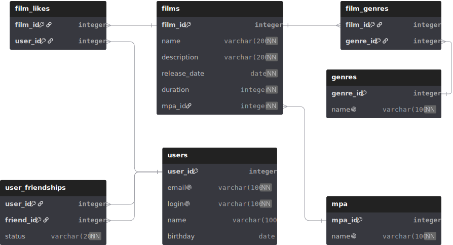

# java-filmorate

## Описание проекта
Проект представляет собой RESTful API, разработанное с использованием Spring Boot. 
Основная цель приложения — предоставить функционал для управления фильмами и оценками пользователей.

## База данных
Для хранения данных используется реляционная база данных. В проекте реализованы сущности для фильмов, 
пользователей и оценок. Каждая сущность имеет свои атрибуты и связи с другими сущностями.

# ER-диаграмма базы данных:
<p align="center">
  
</p>
База данных нормализована к третьей нормальной форме (3NF), 
что обеспечивает минимизацию избыточности данных и улучшает целостность данных.

# Примеры SQL-запросов
Получить список ID друзей пользователя с user_id = 1:
```sql
SELECT  friend_id
FROM user_friendships
WHERE user_id = 1
  AND status = 'CONFIRMED';
```

Получить список ID друзей, ожидающих подтверждения от пользователя с user_id = 1:
```sql
SELECT  friend_id
FROM user_friendships
WHERE user_id = 1
  AND status = 'PENDING';
```

Получить список жанров, к которым относится фильм с film_id = 1:
```sql
SELECT  g.genre_id, 
        g.name
FROM film_genres fg
JOIN genres g ON fg.genre_id = g.genre_id
WHERE fg.film_id = 1;
```

Получить возрастной рейтинг фильма с film_id = 1:
```sql
SELECT  f.name AS film_name, 
        mpa.name AS mpa_rating
FROM films f
JOIN mpa ON f.mpa_id = mpa.mpa_id
WHERE f.film_id = 1;
```

Получить ТОП-5 самых популярных фильмов по количеству лайков:
```sql
SELECT  f.film_id, 
        f.name AS film_name, 
        COUNT(fl.user_id) AS likes
FROM films f
LEFT JOIN film_likes fl ON f.film_id = fl.film_id
GROUP BY f.film_id, f.name
ORDER BY likes DESC,
         f.name ASC
LIMIT 5;
```